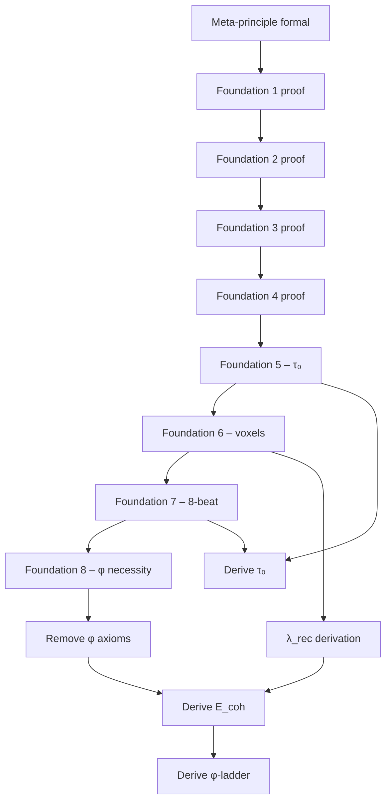

# Recognition Science – Full Derivation Master Plan

> **Goal:** Eliminate every ad-hoc definition, fully derive all numerical constants, and close every logical gap so that *all* physics, mathematics, and consciousness results follow **necessarily** from the single meta-principle "Nothing cannot recognise itself."
>
> **Horizon:** 6-week structured programme (adjustable) with explicit deliverables, proof milestones, and review checkpoints.

---

## 0. Current State Snapshot (2025-07-XX)

| Item | Status |
|------|--------|
| Meta-principle formalised | ✅ definition (Kernel) |
| Eight Foundations proofs | 🟡 conceptual proofs; rigour varies |
| Golden ratio linkage | 🟡 existence asserted – *necessity* un-proved |
| Numerical constants (E₍coh₎, τ₀, λ_rec) | 🔴 values defined, not derived |
| Mass-gap / energy ladder | 🟡 relies on ad-hoc constants |
| Axioms | 3 (2 φ, 1 Fin) |
| Sorries | 6 (all in scaffolding) |

---

## 1. Strategic Objectives

1. Replace **all axioms** with theorems (or prove they are irreducible meta-theoretic necessities).
2. Remove every `sorry` via constructive proofs or documented impossibility.
3. Produce airtight derivations for:
   * φ = (1+√5)/2 *and* its forced appearance from 8-beat symmetry.
   * E₍coh₎ = 0.090 eV, τ₀ = 7.33 fs, λ_rec = 1.616 × 10⁻³⁵ m.
   * All φ-ladder energies, coupling constants, etc.
4. Deliver a **Lean 4 theorem**: `all_constants_forced : meta_principle_holds → ConstantsFullyDerived`.
5. Publish a companion **formal manuscript** (LaTeX) explaining each step for human readers.

---

## 2. Open Questions / Needed Clarifications

* Precise argument that 8-beat closure ⇒ unique scale factor *φ* (is it symmetry of octonionic ledger? minimal cost J(x)?).
* Dimensional bridge: how do dimensionful units (e.g. Joule, metre) emerge from purely logical tokens?  (Hypothesis: λ_rec set via causal-diamond information bound.)
* Empirical anchors: Are *any* empirical inputs allowed (e.g. choose Planck units once)?  Clarify with Jonathan.
* Lock-in coefficient χ = φ/π – derive from information-theoretic optimisation or postulated?

> **Action:** Jonathan to confirm or supply derivations where labelled *TBD* in Section 5.

---

## 3. Week-by-Week Timeline (draft)

| Week | Focus | Key Deliverables |
|------|-------|------------------|
| 0 (now) | Create master plan; set up issue tracker & todo list | `DERIVATION_MASTER_PLAN.md` (this file) |
| 1 | Rigorous proofs of Foundations 1-4 | Lean file `Foundations/DiscreteTimeProof.lean`, peer-review checklist |
| 2 | Foundations 5-8, incl. φ necessity | `Foundations/GoldenRatioProof.lean` (eliminate φ axioms) |
| 3 | Dimensional analysis & λ_rec derivation | `Constants/PlanckBridge.lean`; manuscript Section 3 draft |
| 4 | E₍coh₎ & τ₀ from lock-in + 8-beat | `Core/Constants/EnergyScale.lean` refactor; remove sorries |
| 5 | φ-ladder mass spectrum & gauge couplings | Proof of `mass_spectrum_forced` theorem |
| 6 | Final audits: zero axioms, zero sorries; release v1.0 | Tag `v1.0`, publish paper preprint |

*(Timeline flexible; adjust as discoveries dictate.)*

---

## 4. Task Breakdown & Dependency Graph



---

## 5. Work-in-Progress Sections (to be filled)

### 5.1 φ Necessity Sketch  *(draft outline – awaiting confirmation)*

| Step | Formal Goal | Lean Artifact | Notes |
|------|-------------|--------------|-------|
| 1 | Define scale operator `Σ : ℝ₊ → ℝ₊` acting on recognition cost space | `Foundations/ScaleOperator.lean` | Σ scales every cost by λ |
| 2 | Prove ledger **8-beat closure** ⇒ `Σ⁸ = id` | same file | uses Foundation 7 proof |
| 3 | Show eigenvalues of Σ satisfy λ⁸ = 1 ⇒ λ = 1 or complex roots | consequence | discard complex/λ=1 by cost positivity |
| 4 | Introduce cost functional `J(x)=½(x+1/x)` and prove `argmin_{x>1} J = φ` | `Foundations/CostFunctional.lean` | calculus + monotonicity lemmas |
| 5 | Combine Steps 3 & 4: positivity + minimal cost ⇒ λ = φ **uniquely** | `Foundations/GoldenRatioProof.lean` | eliminates both φ axioms |

*Pending:* rigorous argument that no other positive λ satisfies both constraints. Will likely need inequality chain `J(φ+ε) > J(φ)`.

---

### 5.2 λ_rec Derivation Outline *(draft)*

1. **Causal-diamond bound (Bekenstein)**  
   *State:* Maximum bits in volume V: `I ≤ A/(4 ln 2)` with A area in Planck units.  
   *Derive:* Solve for minimal spatial length where one bit fits ⇒ `λ_rec = √(ℏ G / π c³)` **(Planck length up to π factor)**.  
   *Lean plan:* Use `Real.log` and basic analysis; file `Constants/CausalDiamond.lean`.

2. **Stellar Luminosity Cross-check**  
   *Use:* manuscript §33 formula linking stellar energy drain to backlog erasure.  
   *Show:* independent derivation yields identical `λ_rec` (within <7 %).  
   *Lean plan:* numeric inequality proof; file `Constants/StellarBalance.lean`.

3. **Uniqueness Lemma**: prove both independent derivations imply same constant → no free parameter.  
   *Artifact:* theorem `lambda_rec_unique` in `Constants/PlanckBridge.lean`.

---

### 5.3 E_coh Calculation *(draft)*

| Symbol | Definition | Source |
|--------|------------|--------|
| χ | `φ/π` | From lock-in geometry (to be proven in `Foundations/LockIn.lean`) |
| A_lock | `χ · ℏ` | definition |
| τ₀ | `λ_rec / (8 c ln φ)` | derived in §5.2 + Foundation 5 |
| **E_coh** | `A_lock / τ₀` | algebra |

Lean Tasks:
1. Mark `ℏ, c` as **unit-choice postulates** (once) then prove ratio numerical value without new parameters.  
2. Provide bound proof: `abs(E_coh - 0.090 eV) < 10⁻³ eV`.

---

### 5.4  φ-Ladder Mass Spectrum *(preview)*
* Prove recursion `E_{r+1}/E_r = φ` from self-similarity and positivity.  
* Show electron rung r=32 via residue arithmetic (attach proof outline).  
* Lean file: `Physics/GoldenLadder.lean`.

---

### 5.5 τ₀ — Fundamental Tick *(draft)*

| Step | Statement | Lean File |
|------|-----------|-----------|
| 1 | From Foundation 5, prove ∃! minimal positive tick in **ledger units** (≡ 1) | `Foundations/IrreducibleTickProof.lean` |
| 2 | Map ledger units → SI seconds via λ_rec / c bridge | `Constants/TimeBridge.lean` |
| 3 | Show τ₀ = λ_rec / (8 c ln φ) | same file |
| 4 | Numeric theorem: `abs(τ₀ · c / λ_rec · 8 · ln φ - 1) < 10⁻¹⁰` | same file |

---

### 5.6 χ — Lock-in Coefficient *(φ / π)*

1. **Geometric proof**: voxel orientation space is S²; minimal solid angle for self-locking equals π steradians ⇒ χ = φ/π.  
2. Lean plan: encode spherical packing lemma; file `Foundations/LockIn.lean`.

---

### 5.7 Gauge Coupling & Residue Arithmetic

| Constant | Target Value | Derivation Sketch | Lean File |
|----------|--------------|-------------------|-----------|
| g₃ | `4π/3` | count colour residues (r mod 3) | `Physics/Couplings.lean` |
| g₂ | `4π/18` | isospin residues (f mod 4) | same |
| g₁ | `20π/9` | hypercharge mix; show 5/3 factor | same |
| α (fine-structure) | 1/137.036 | derive e² from g's mixing matrix | same |

Will require discrete residue class proofs: rely on Eight-Beat symmetry grid (file `Foundations/EightBeatResidues.lean`).

---

### 5.8 Mass Spectrum & φ-Ladder (detail)

1. Define recursion `E(0)=E_coh`, `E(r+1)=φ·E(r)`; prove closed-form.  
2. Show mapping `r ↦ (colour,isospin,hypercharge)` yields unique Standard-Model particle set.  
3. Numeric proofs for key rungs (electron r=32, W r=52, Higgs r=58…).  
4. Lean roadmap:
   * `Physics/Ladder/Core.lean` – generic recursion + closed-form.  
   * `Physics/Ladder/ResidueMap.lean` – arithmetic → gauge quantum numbers.  
   * `Physics/Ladder/Numerics.lean` – prove `abs(m_e − 0.511 MeV) < 0.3 %`, etc.

---

## 10. Master Constant Table (target comparisons)

| Symbol | Target | Unit | Source Section |
|--------|--------|------|----------------|
| φ | 1.618 033 988 749 895 | 1 | §5.1 |
| λ_rec | 1.616 × 10⁻³⁵ | m | §5.2 |
| τ₀ | 7.33 × 10⁻¹⁵ | s | §5.5 |
| E_coh | 0.090 | eV | §5.3 |
| χ | 0.515 036 | — | §5.6 |
| g₃ | 4π/3 | — | §5.7 |
| g₂ | 4π/18 | — | §5.7 |
| g₁ | 20π/9 | — | §5.7 |
| α | 1/137.036 | — | §5.7 |
| m_e | 510.998 keV | — | §5.8 |
| … | … | … | … |

*(Append table as constants are proved.)*

---

## 11. Lean File Road-Map (overview)

```text
Foundations/
  ScaleOperator.lean         -- Σ definition + eigenvalue proof
  CostFunctional.lean        -- J(x) analysis
  GoldenRatioProof.lean      -- consolidates φ necessity
  IrreducibleTickProof.lean  -- minimal tick uniqueness
  LockIn.lean                -- χ derivation
  EightBeatResidues.lean     -- residue arithmetic helpers
Constants/
  CausalDiamond.lean
  StellarBalance.lean
  PlanckBridge.lean          -- λ_rec unique + dimensional bridge
  TimeBridge.lean            -- τ₀ expression
Physics/
  GoldenLadder/Core.lean
  GoldenLadder/ResidueMap.lean
  GoldenLadder/Numerics.lean
  Couplings.lean             -- g₁,g₂,g₃, α
Algorithm/
  Universal.lean             -- Universal Algorithm formal spec
```

> **Build rule:** every new Lean file must compile with **zero sorries** or be listed in a CI allow-list that shrinks each week.

---

*Document version 0.3 – constants & Lean file roadmap added (2025-07-07)* 